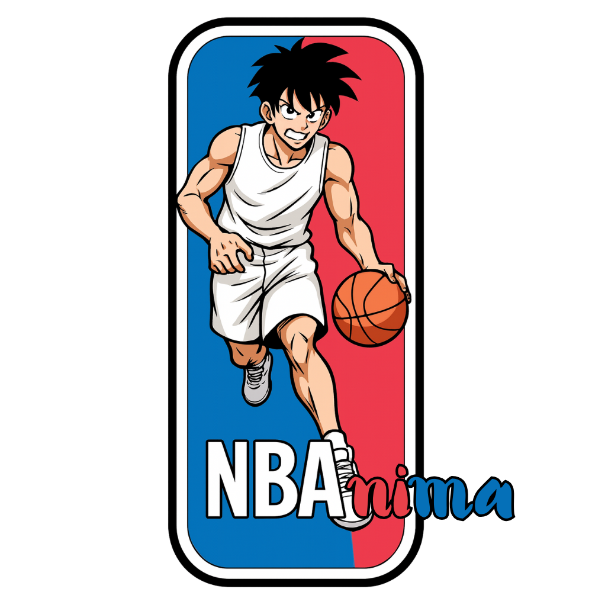

# NBAnima

NBAnima is a production-ready Next.js (App Router) platform that makes NBA nights more ANIMA-ted. Fans lock daily picks, admins settle results, and everyone collects digital cards driven by Anima Points.

## Stack

- **Next.js 16** · App Router, Server Components, server actions
- **TypeScript + Tailwind CSS** · custom dark navy & gold NBA theme
- **Supabase** · PostgreSQL, Auth, RLS security, serverless functions
- **Zod** validation, **SWR** data fetching, **lucide-react** icons
- Pluggable data providers (balldontlie / SportsDataIO)

## Quick Start

```bash
npm install
cp .env.example .env
# fill in Supabase + provider keys
npm run dev
```

Open `http://localhost:3000` – middleware redirects to `/it` (Italian default). Switch language with the IT/EN toggle (persisted in `localStorage`, reflected in `/it` / `/en` routes).

> Su Netlify, i redirect si delegano al plugin Next; non usare rewrites 200 verso `index.html` per gestire le rotte i18n.

### Environment Variables

| Variable | Description |
| --- | --- |
| `SUPABASE_URL` | Supabase project URL |
| `SUPABASE_ANON_KEY` | Supabase anon key (client) |
| `SUPABASE_SERVICE_ROLE_KEY` | Service role key (server actions + APIs) |
| `NEXT_PUBLIC_SUPABASE_URL` | Same as above, exposed client-side |
| `NEXT_PUBLIC_SUPABASE_ANON_KEY` | Same as above, exposed client-side |
| `NEXT_PUBLIC_APP_URL` | Base URL for internal API calls (e.g. `http://localhost:3000`) |
| `NB_API_PROVIDER` | `balldontlie` (default) or `sportsdataio` |
| `BALLDONTLIE_API_KEY` | Optional key when using balldontlie |
| `SPORTSDATAIO_API_KEY` | Required when `NB_API_PROVIDER=sportsdataio` |

## Database

1. Execute `schema.sql` in your Supabase SQL editor to create tables, enums, RLS policies, helper function `is_admin()` and constraints.
2. Seed demo games/cards with `seed.sql`.

Tables cover users, games, picks, highlight results, ledgers, and the shop inventory. RLS ensures players only touch their own picks while admins can manage the entire dataset.

## Features Overview

- **Localized marketing homepage** (`/[locale]`) with glow cards, CTA buttons, and Italian/English content.
- **User dashboard** (protected) showing Anima Points, Play tabs for Teams/Players/Highlights, optimistic pick workflow, lock-window guardrails, and collection/shop views with card overlays.
- **Admin console** (role-gated) with search/filterable user table (balance adjustments & card assignment via server actions), picks explorer by user/date, and highlight submission that triggers the settlement pipeline.
- **API layer**
  - `/api/games` · nightly slate via provider abstraction
  - `/api/players` · roster per game
  - `/api/boxscore` · winners + stat leaders
  - `/api/picks` · CRUD with Zod validation, lock-window, change limits
  - `/api/settle` · daily scoring (teams, players, highlights) + ledger writes
- **Pluggable data providers** in `src/lib/providers`, selectable through `NB_API_PROVIDER`.
- **Styling** with bespoke Tailwind theme (`tailwind.config.ts`, `globals.css`) delivering dark navy gradients, gold borders, glassmorphism cards, and pastel accents.

## Scripts

| Command | Description |
| --- | --- |
| `npm run dev` | Start local development server |
| `npm run build` | Production build |
| `npm run start` | Launch built app |
| `npm run lint` | ESLint via `next lint` |

## File Highlights

- `src/app/[locale]` · locale-aware routes (homepage, dashboard, admin)
- `src/components/dashboard` · client-side dashboard shell, optimistic pick UX
- `src/components/admin` · admin console with server-action integrations
- `src/lib` · constants, env parsing, Supabase helpers, scoring pipeline, lock-window & pick validators
- `schema.sql` / `seed.sql` · database blueprint + starter content

## Next Steps

- Plug in Supabase Auth providers for end-to-end session management.
- Extend server actions with real-time (`postgres_changes`) updates for picks and ledger entries.
- Add scheduled job (Edge Function / Cron) to call `/api/settle` nightly with completed results.

Enjoy making the NBA even più anima-ta! 🏀
